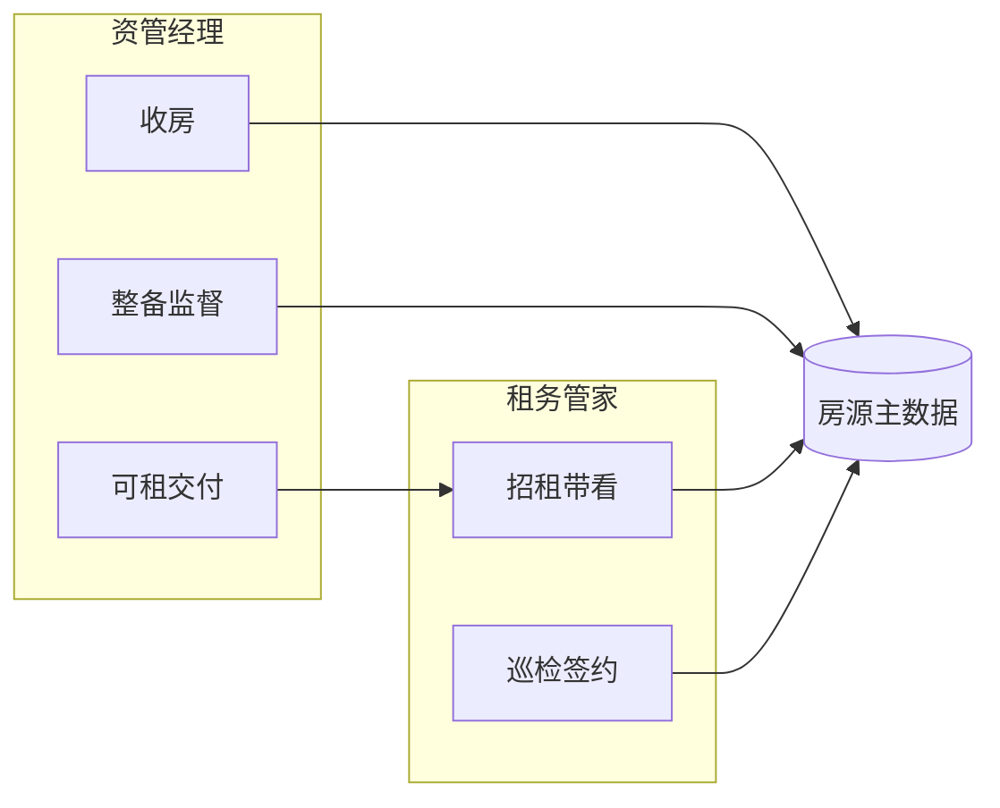

# 资管经理（AM）画像深度分析报告

> **版本**: v1.0  
> **更新**: 2026-04-10  
> **适用**: 惠居上海 · 省心租资管经理（与租务管家 AM 区分）  
> **依据**: [AI应用于管理模式规划 (1).txt](meeting/AI应用于管理模式规划%20(1).txt)、[PRD1.1-multi-role-task.md](prd/PRD1.1-multi-role-task.md)、[metrics.md](prd/metrics.md) 中绩效提升管理制度摘要、本仓库后端实现  

**说明**：仓库内未检出历史 `资管经理画像深度分析报告.docx` 源文件；本文档按管理会议目标、多角色打卡 PRD 与制度摘要 **重构并扩展**。若与人力/资管条线发布的 Q4 晋降级细则最终版不一致，**以正式发布制度为准**。

---

## 1. 角色定位与价值链

资管经理处于 **收房 → 整备/监督 → 可租状态交付** 的前半程，决定了房源进入运营池时的 **质量、成本与时点**，直接影响后续租务管家的 **招租效率与去化周期**。

| 维度 | 资管经理典型职责 |
|------|------------------|
| 收房拓展 | 收房谈判、合同与交割节点 |
| 整备监督 | 装修/供应商协调、现场进度与质量（对应 PRD 中「整备监督打卡」等） |
| 资产质量 | 房源达标、风险隐患排查、验收 |

---

## 2. 管理盲区与会议共识痛点

摘自 2026-03-31 会议精神的高度概括：

- **末端行为黑箱**：不清楚资管经理「此刻是否在岗、在具体哪套房上、做什么动作」；管理动作常退化为 **周维度的述职或拉榜**（如「收房最差 5 人」），而非连续、可干预的过程数据。
- **与「管到一套房」脱节**：缺乏装修前后对比、分维度评分的结构化沉淀，难以把 **单套房源品质与经管动作** 关联。
- **分析一次性**：业测/财务/人力临时拉表，无法 **按周或实时** 复盘同一批人、同一批房。

---

## 3. 绩效与晋降级规则映射（制度对齐）

### 3.1 Q4 季度考核结构（摘要 — 待与正式制度校验）

与租务管家「系数 A/C 百分位制」不同，资管条线通常采用 **结果类硬指标 + 加减分/排名**，具体如下表（与 [绩效与晋降级规则对比分析.md](绩效与晋降级规则对比分析.md) 一致）。

| 维度 | 资管经理（典型设计） |
|------|----------------------|
| 核心指标 | **收房套数（阶梯赋分）** + **综合去化率**（或同类组合） |
| 权重 | 常见口径为 **各 50%**（以公司文件为准） |
| 升级 | 季度排名 **前 20%（含）** + **业绩底线**满足 |
| 降级 | **后 20%** 触发降级评估（可有豁免条件，如收房≥24 套或去化≥85%） |
| 低绩效 | **《绩效提升管理制度 3.0》**：如 **月度收房 ≤4.5 套** 等底线未达标 → 进入渐进式管理 |

### 3.2 《绩效提升管理制度 3.0》要点（租务与资管共用框架片段）

摘自 [metrics.md §9](prd/metrics.md)：

- **渐进式流程**：第 1 次进入名单 → 降级 + **总监绩效辅导（月度，AI 评分）**；第 2 次 → 再降级 + 大部总辅导；第 3 次 → 不胜任认定等。
- **连带**：管家连续低绩效可影响对应 **总监月度得分**（制度原文见 metrics.md）。

以上对资管经理同样具有 **参照意义**：系统需支持 **低绩效名单、辅导记录、录音/纪要归档**，而非仅算排名。

---

## 4. 画像分层模型（AI 管理转型视角）

### 4.1 感知层（末端可观测）

| 信号 | 说明 | 本仓库支撑 |
|------|------|------------|
| 整备/验收 NFC + GPS | 到房、时长、照片 | [attendance_records](prd/database.md)、多任务类型见 [PRD1.1](prd/PRD1.1-multi-role-task.md) |
| 工单/供应商节点 | 派工、完工、整改闭环 | 待对接业务系统 |
| 在岗与行程 | 是否可类比「骑手在线」 | 需策略与合规界定后再上实时看板 |

### 4.2 执行层

- 收房任务拆解、整备里程碑、关键节点 **超时预警**；与租务侧 **可租释放** 时间对齐。

### 4.3 决策与协同层

- **去化率预警**：结合合同到期、续约概率、渠道询价，对资管侧「投入整备的资源」给 **建议而非唯算法**。
- **收房机会识别**（AI 场景）：基于区域库存、历史收房转化，辅助 **线索优先级**（需房源与交易数据）。

### 4.4 激励层

- 会议讨论参照美团/滴滴的 **按件、响应率** 机制；资管存在 **跨岗协作**，适合 **「可独立计件的现场动作」试点**，全盘按单计酬需 **制度试点** 配合。

---

## 5. 与租务管家的协同画像

**交叉分析指标示例**：

- 从收房交割到 **首带看**、**首签** 的 **时常分布**（衔接效率）。
- 同一房源上 **资管 NFC 整备次数/质量分** vs **管家带看转化**（品质是否支撑招租）。

---

## 6. 系统实现映射（本仓库）

| 能力 | 状态 | 说明 |
|------|------|------|
| 多角色任务打卡（含资管 `ASSET_MANAGER`） | PRD 已定，能力随 App/后端扩展 | [PRD1.1-multi-role-task.md](prd/PRD1.1-multi-role-task.md) |
| `house_assignments` 分配校验 | 已实现实体与规则注释 | [house-assignment.entity.ts](../demo/backend/src/house/house-assignment.entity.ts) |
| 租务侧系数 A/B/C 计算 | Demo 可实现 SHOWING/INSPECTION/SIGNING | [performance.service.ts](../demo/backend/src/performance/performance.service.ts) |
| **资管阶梯赋分、综合去化率、降级豁免** | **未实现** | 需业务口径 + 数据源 |
| 低绩效名单、客诉、AI 辅导评分 | **未实现/待对接** | metrics.md 已列接口需求 |

**代码差异说明**：当前 `PerformanceService` 中月度得分对管家为 **系数原始值加权**，制度要求 **百分位排名 × 权重**；上线前需按 [metrics.md §13](prd/metrics.md) 校准。

---

## 7. 阶段性画像演进（与转型路线图对齐）

| 阶段 | 时间（建议） | 资管侧目标 |
|------|----------------|------------|
| Phase 1 可观测 | 0～3 月 | 整备/验收类 NFC+照片 **上线试点**；收房关键节点 **线上化** |
| Phase 2 数据化 | 3～6 月 | **收房阶梯分 + 去化** 与业策/财务口径跑通；经分看板 |
| Phase 3 智能化 | 6～12 月 | 去化/空置风险 **预测与工单建议**；整备图像 **前后对比 AI**（与房源画像联动） |
| Phase 4 协同 | 12 月+ | 资管—租务 **统一房源时间轴**；机制试点（激励与派单） |

---

## 8. 即刻可落地事项（建议）

1. 选定 **资管试点战队**，启用与 PRD 一致的 **整备监督打卡** 类型与照片规范。  
2. 与人资/业策确认 **Q4 正式稿**：阶梯赋分表、去化定义、豁免条款。  
3. 在 [metrics.md](prd/metrics.md) 中单列 **资管指标字典**，避免与租务 AM 混用。

---

## 9. 参考文档

- [docs/meeting/AI应用于管理模式规划 (1).txt](meeting/AI应用于管理模式规划%20(1).txt)  
- [docs/prd/PRD1.1-multi-role-task.md](prd/PRD1.1-multi-role-task.md)  
- [docs/prd/metrics.md](prd/metrics.md)  
- [docs/prd/database.md](prd/database.md)  
- [docs/租务管家画像深度分析报告.md](租务管家画像深度分析报告.md)（差异对照）  
- [docs/房源画像深度分析报告.md](房源画像深度分析报告.md)（「管到一套房」）
